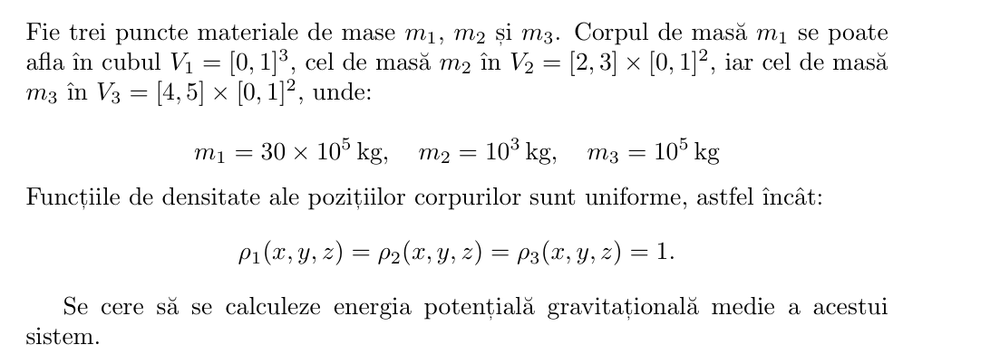
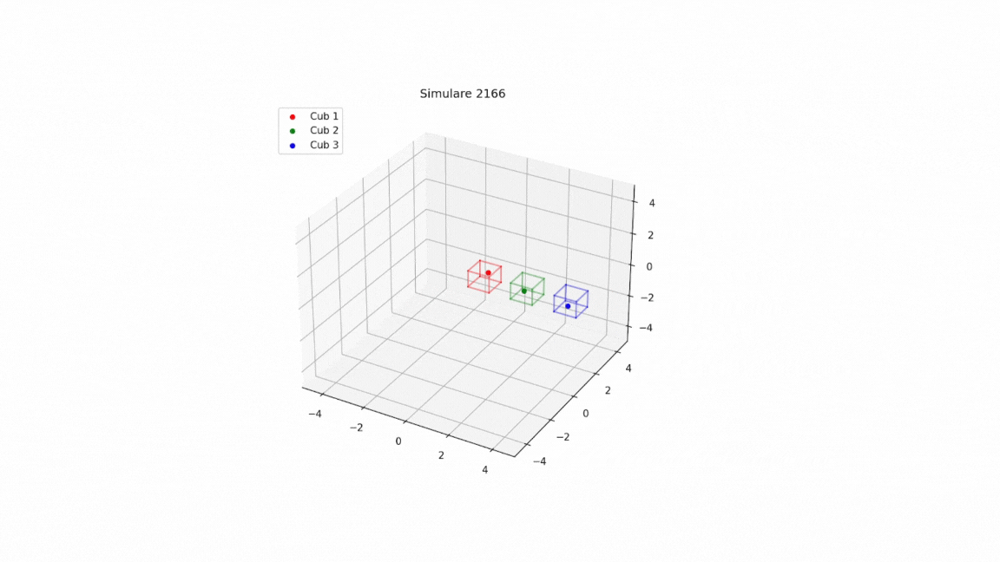

# Determinarea energiei potențiale gravitaționale medii utilizând metoda Monte Carlo

## Descrierea proiectului 

Proiectul urmărește determinarea energiei potențiale gravitaționale medii într-un sistem de 3 corpuri, prin 2 metode: o metodă bazată pe simulări Monte Carlo și o metodă matematică.
În final, se compară rezultatele și se arată convergența simulărilor către rezultatul matematic.

## Enunțul problemei rezolvate

Pentru mai multe detalii despre enunț, dar și metodele de rezolvare, vă rugăm să consultați [documentația](Documentație.pdf).

În contextul simulărilor, pozițiile celor 3 corpuri sunt redate vizual mai jos:

## Instrucțiuni de utilizare

Pentru performanță sporită și posibilitatea de paralelizarea a calculului cu ajutorul GPU-ului, se recomandă compilarea codului în Google Colab, după cum poate fi văzut [aici](https://tinyurl.com/codMonteCarlo). 

## Referințe bibliografice

https://github.com/esa/torchquad

https://www.youtube.com/watch?v=GOiTF11umMo&t=111s

https://en.wikipedia.org/wiki/Gravitational_energy

https://en.wikipedia.org/wiki/Three-body_problem

https://www.youtube.com/playlist?list=PLUeHTafWecAXDF9vWi7PuE2ZQQ2hXyYt_
